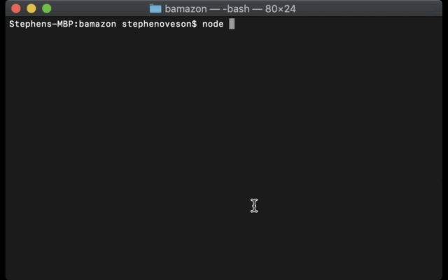
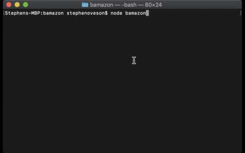

# bamazon SQL Application

### What and Why
        This project was undertaken as a project using SQL to create and develop a system that allows for the change and storage of shopping data using MySQL.
### Overview of application
        This project allows for both a customer to run through a shopping scenario involving purchasing of products. It also allows for a manager to log in and view all products, add quantity to a product, view products with low inventory, and add a new product.
        The combination of the two, customer and manager, allow for a powerful store using SQL.

### How to Use
##### Instructions to run the application:
Tools:
* NodeJS
* A command line interface
* NPM
* SQL
* MAMP

Instructions:
        Using the CLI do an "NPM install"
        This should install the packages needed to run our application
        Using the code found in the bamazondb.sql you can put that into sequel pro or another sql program and create a database with a table that contains certain values.
        Now do a "node bamazonCustomer.js"
        This will start our storefront that allows customers to purchase items that are "in stock" according to our database
        You can do a "node bamazonManager.js" and gain access to view all products, add stock to a product, view which products are low on stock, and add a new project.

### Screenshots and Video
* Demonstration of the bamazonCustomer.js file

* Demonstration of the bamazonManager.js file

### Technologies Used
* MySQL
* NodeJS
* JS
* NPM

### My role

        I am the developer of this project and have built it from 
        scratch using the mentioned technologies above.
